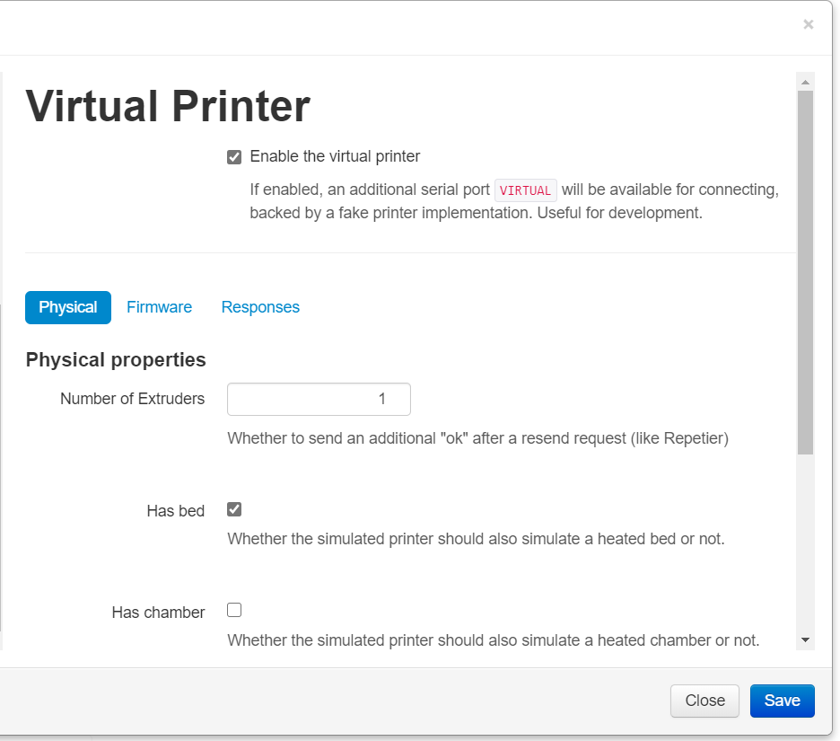

# Virtual Printer Settings

Add easily configurable and well organised settings for OctoPrint's virtual printer.
Overrides the default template which only has an enabling checkbox.

Very useful if you are developing plugins, or even core OctoPrint. No more digging deep into config.yaml and hoping you typed the settings correctly!

#### Warning: Only compatible with OctoPrint 1.4.1 and higher, please update!

## Setup

Install via the bundled [Plugin Manager](https://docs.octoprint.org/en/master/bundledplugins/pluginmanager.html)
or manually using this URL:

    https://github.com/cp2004/OctoPrint-VirtualPrinterSettings/archive/master.zip

## Configuration

Plugin adds settings to OctoPrint's UI that are [documented here](https://docs.octoprint.org/en/1.4.1/development/virtual_printer.html#virtual-printer-configuration-options)

It replaces the original implementation, introduced in OctoPrint 1.4.1

